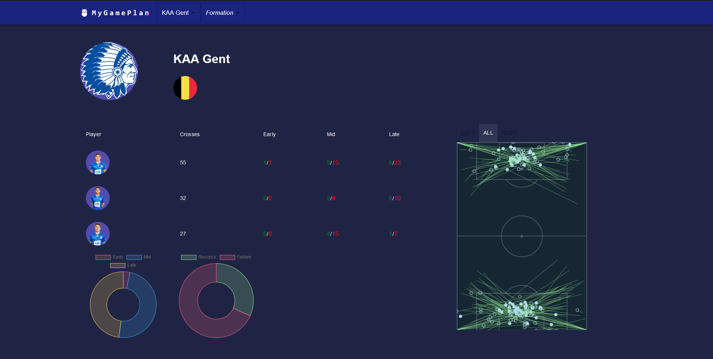

# MyGamePlan_Assignment
A technical assignment for MyGamePlan ⚽⚽⚽



# Setup

Install:

``` markdown
npm install
```

Place the secret .env file in the root directory of the backend project

Start the application (backend and frontend):

``` markdown
npm start
```

Graphql code generation (frontend):

``` markdown
npm run codegen
```